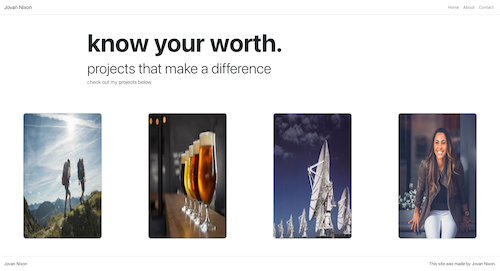

# Portfolio-React-

# Description 

This is my Portfolio.  
Hope you like it. 
Don't forget to connect with me. 

# Table of Contents

1. [Description](#Description)
2. [Features](#Features)
3. [License](#License)
4. [Questions](#Questions)
5. [Usage](#Usage)
6. [Badges](#Badges)

## Features
- NodeJS
- React

# License

## This application is covered by the MIT license. 
 

# Questions
## GitHub User name 
https://github.com/jmnfire

# Usage 

### Link to GitHub:
https://github.com/jmnfire/Portfolio-React-

### Link to live site
https://vibrant-saha-68e4e6.netlify.app/

### Email address 
jovan.m.nixon@gmail.com

# Badges

